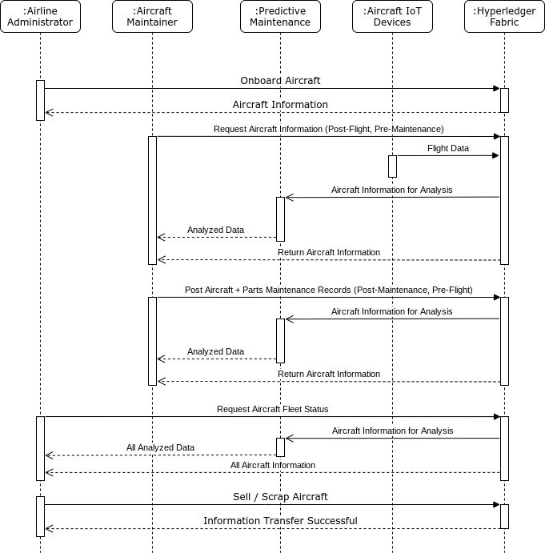

# Avion-MRO
(Build on Hyperledger Fabric)

## Description

There is a huge and intricate supply chain for the aerospace sector that includes hundreds to thousands of businesses and millions of parts. Every link in the supply chain needs to adhere to the rules and guidelines set forth by regulating authorities from governments and other organisations. The different stages of aircraft development and deployment, including part procurement, aircraft assembly, certification, delivery, maintenance, and end-of-life, show the numerous elements of the supply chain.

This project seeks to provide a targeted solution for airline companies and the required maintenance, repair, and overhaul (MRO) cycle for purchased aircraft rather than an umbrella solution for the entire aerospace supply chain. The goal is to digitise maintenance and parts provenance records in a way that increases trust when selling the aircraft, saves money through a more streamlined process, and, most importantly, improves air travel safety.

The proposed solution aims to solve the most perplexing problem in supply chain management: how to increase reliability, safety, and quality while lowering costs.

### Background

A typical airline company's aircraft goes through the following cycle:
  
After delivery, the aircraft goes through a cycle of maintenance and flights until it is decided to sell it or scrap it. Parts for MRO procedures may be retrieved from a scrapped aircraft or supplied as completely new by other sources. Because they have not surpassed their flying hour limit, these components are still usable.

The problem is that many maintenance records are still kept on paper, and the record for an aircraft may consist of binders full of different types of data. The provenance of parts that have been used in other aircraft may also be incorrect, and they may also lack vital information about their longevity. Overall, it's harder to access and manage information, which puts customers' lives in danger and introduces inefficiencies to meticulously tailored flight schedule plans.

### Solution Architecture

The suggested solution makes use of Hyperledger Fabric, a blockchain platform, to share and track aircraft information both inside an airline and with other carriers when an aircraft is being sold. MRO suppliers may simply keep maintenance and parts provenance data on the blockchain network by manually updating them and integrating IoT devices.

IoT devices frequently produce enormous volumes of data, and it can be challenging to search for problematic trends in that data. The suggested system would involve a machine learning algorithm for predictive maintenance in addition to blockchain and IoT technology. The programme would be able to notify maintainers of potential problems or noteworthy trends in aircraft condition by gaining access to the maintenance logs and IoT data across many aircraft.

## Technical Details

The following sections go over the technical parameters that were used: Hyperledger Fabric, the Expresss API, and the React front-end.

### Architecture

**Hyperledger Fabric**  
Blockchain as a backend for storing information about aircraft and parts based on the data and parameters specified below. For proof of concept, the current implementation employs only a single channel, user, and administrator. Depending on the scale and number of companies, future implementations would use different channels, users, administrators, and private data storage.

**Express API**  
The API for connecting to a cloud-based instance of Hyperledger Fabric is Express.js. The instance in this case is based on a Heroku virtual machine. In the future, multiple APIs would be distributed across multiple nodes/clients. Furthermore, the cloud-based instance would almost certainly be converted from a virtual machine to a cloud-based kubernetes cluster.

**React**  
During the Proof of Concept phase, React serves as the demonstration front-end for a single login point. Furthermore, the site should be mobile friendly so that maintainers can use it on the job without needing a large device. Companies will be able to develop their own front-end applications in the future to interact with various API endpoints.

### Modeling

The following diagram shows the 5 different types of interactions for the PoC.

1. Airline adminstrator onboards a new aircraft from manufacturer.
1. Maintainer requests information about the aircraft after a flight and before maintenance.
1. Maintainer submits maintenance information about the aircraft before a flight.
1. Administrator requests information on entire fleet.
1. Administrator sells or scraps the aircraft.

_Note: PoC does not include IoT devices or predictive maintenance._

Additional pieces of modeling can be found in the `documentation` folder:

- [User stories](./documentation/userStories.md)
- [Class diagram](./documentation/classDiagram.png)

### Data/Parameters

_Stored in Hyperledger Fabric_

**Aircraft Object**

| Parameter             | Type                                                                                         | Description                                                                                                                                                                                           |
| --------------------- | -------------------------------------------------------------------------------------------- | ----------------------------------------------------------------------------------------------------------------------------------------------------------------------------------------------------- |
| `description`         | `{string aircraft, string tailNumber}`                                                       | For identifying the specific aircraft                                                                                                                                                                 |
| `maintenanceSchedule` | `[{string type, number lastCompletedDate, number lastCompletedHours, number maxHours}, ...]` | An array that tracks the current status of major maintenance cycles                                                                                                                                   |
| `partsList`           | `[string partID, ...]`                                                                       | An array of parts that are currently on the aircraft                                                                                                                                                  |
| `flightHours`         | `number`                                                                                     | Number tracking total number of flight hours for the aircraft                                                                                                                                         |
| `owner`               | `[{string company, number purchaseDate, number soldDate}, ...]`                              | Array tracking purchase/sell history of aircraft (last entry is current owner)                                                                                                                        |
| `maintainers`         | `[string username, ...]`                                                                     | Array listing maintainers for the aircraft (who has access to update aircraft information)                                                                                                            |
| `maintenanceReports`  | `[{number date, string type, string notes, object partsReplaced}, ...]`                      | Array listing the various maintenance reports, inspections, etc; the `partsReplaced` object is a key value pair where the key is the ID of the replaced part, and the value is the ID of the new part |

**Part Object**

| Parameter      | Type                                                                      | Description                                                                                                        |
| -------------- | ------------------------------------------------------------------------- | ------------------------------------------------------------------------------------------------------------------ |
| `description`  | `{string id, string name}`                                                | Number refers to the general part number, especially for replaceable parts, name is a written out name of the part |
| `totalHours`   | `number`                                                                  | Tracking the total number of flight hours for the part                                                             |
| `maximumHours` | `number`                                                                  | Maximum flight hours for the part                                                                                  |
| `history`      | `[{string tailNumber, number hours, number onDate, number offDate}, ...]` | Array showing history of the part, the last index is the most recent                                               |

**User Object**

| Parameter  | Type                | Description                                                                                          |
| ---------- | ------------------- | ---------------------------------------------------------------------------------------------------- |
| `username` | `string`            | stored username                                                                                      |
| `password` | `string`            | hashed password                                                                                      |
| `type`     | `string`            | Can be `admin` or `maintainer`                                                                       |
| `company`  | `string`            | The company that the user works for                                                                  |
| `aircraft` | `[tailNumber, ...]` | An array of tailNumber that the user has access to maintenance records of the corresponding aircraft |

### Functions

_Functions for managing data and interacting with data from outside Hyperledger_

**Chaincode Functions**

| Function Name        | Input                                                                      | Output              | Restricted                  | Details                                                                                                                                     |
| -------------------- | -------------------------------------------------------------------------- | ------------------- | --------------------------- | ------------------------------------------------------------------------------------------------------------------------------------------- |
| `registerUser`       | string `username`, string `password`, string `type`, string `company`      | bool `success`      | Admin + Maintainer          | Creates a user profile for the admin or maintainer, hashed username and password are stored in blockchain, fails if username already exists |
| `checkUser`          | string `username`, string `password`, string `type`, string `company`      | object `user`       | Admin + Maintainer          | Checks the username and password against blockchain information, and returns a boolean                                                      |
| `registerAircraft`   | string `aircraft`, string `tailNumber`, string `company`                   | string `tailNumber` | Admin                       | Register a new aircraft and create the aircraft object                                                                                      |
| `assignAircraft`     | string `username`, string `tailNumber`, string `company`                   | bool `success`      | Admin                       | Assign the maintainer to the aircraft so they have access to the data                                                                       |
| `getAircraft`        | string `tailNumber`                                                        | object `aircraft`   | Admin + Assigned Maintainer | Gets all of the information for a specific aircraft in the format described above                                                           |
| `newPart`            | object `part`                                                              | string `partID`     | Maintainer                  | Register new part in system                                                                                                                 |
| `getPart`            | string `partID`                                                            | object `part`       | Admin + Assigned Maintainer | Gets all of the information for a specific part in the format described above                                                               |
| `updateFlightHours`  | string `tailNumber`, number `hours`                                        | number `hours`      | Assigned Maintainer         | Updates the flight hours for the aircraft and its associated parts (in the future this will be called by IoT devices)                       |
| `performMaintenance` | string `tailNumber`, string `type`, string `notes`, object `replacedParts` | object `aircraft`   | Assigned Maintainer         | Stores the maintenance record for the specified aircraft                                                                                    |
| `replaceParts`       | string `tailNumber`, object `replacedParts`                                | bool `success`      | Assigned Maintainer         | Updates the aircraft and part objects, if new part is entered it creates a new entry                                                        |
| `sellAircraft`       | string `tailNumber`, string `company`                                      | bool `success`      | Admin                       | Transfers ownership of aircraft to new account, and removes maintainers access                                                              |
| `getMaintainers`     | string `company`                                                           | array `maintainers` | Admin                       | Returns a list of all maintainers for a specific company                                                                                    |
| `getCompanies`       |                                                                            | array `companies`   | Admin + Maintainer          | Returns a list of all companies                                                                                                             |

**API Endpoints**

| Endpoint                                       | Type  | Chaincode Function                    | Returns               |
| ---------------------------------------------- | ----- | ------------------------------------- | --------------------- |
| `\` | GET | `getCompanies` | array `companies` |
| `\login`                                       | POST  | `registerUser`                        | bool `success`        |
| `\login`                                       | POST  | `checkUser`                           | string `jsonwebtoken` |
| `\aircraft`                                    | POST  | `registerAircraft`                    | object `aircraft`     |
| `\aircraft`                                    | GET   | `getAircraft`                         | object `aircraft`     |
| `\aircraft`                                    | PATCH | `performMaintenance` + `replaceParts` | object `aircraft`     |
| `\part`                                        | GET   | `getPart`                             | object `part`         |
| `\part`                                        | POST  | `newPart`                             | string `partID`       |
| `\flight`                                      | POST  | `updateFlightHours`                   | number `hours`        |
| `\admin`                                       | POST  | `assignAircraft`                      | bool `success`        |
| `\admin`                                       | PATCH | `sellAircraft`                        | bool `success`        |
| `\admin`                                       | GET   | `getMaintainers`                      | array `maintainers`   |

## Goals + Tasks

- [x] Hyperledger Fabric (maintenance schedule + parts provenance)
  - [x] Complete logic
  - [x] Storing more parameters - if necessary
- [x] Express API
  - [x] basic API
  - [x] user validation using JWT
- [ ] React front-end
  - [ ] Basic framework
  - [ ] Mobile friendly site
  - [ ] Status indicator for front-end on connecting to API
  - [ ] Administrator interactions
  - [ ] Maintainer interactions

## Notes

- Validation with JSON web tokens is not a good security practice. JWT was used for ease of implementation for PoC.
- Deployed site login instructions: If it is in offline mode (icon indicator is red in the top right corner) - any username/password combination will work.
